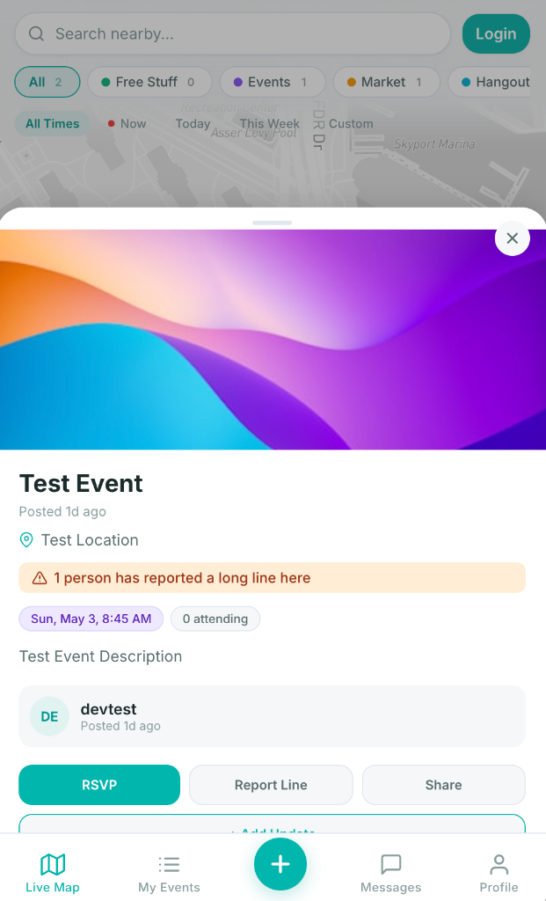
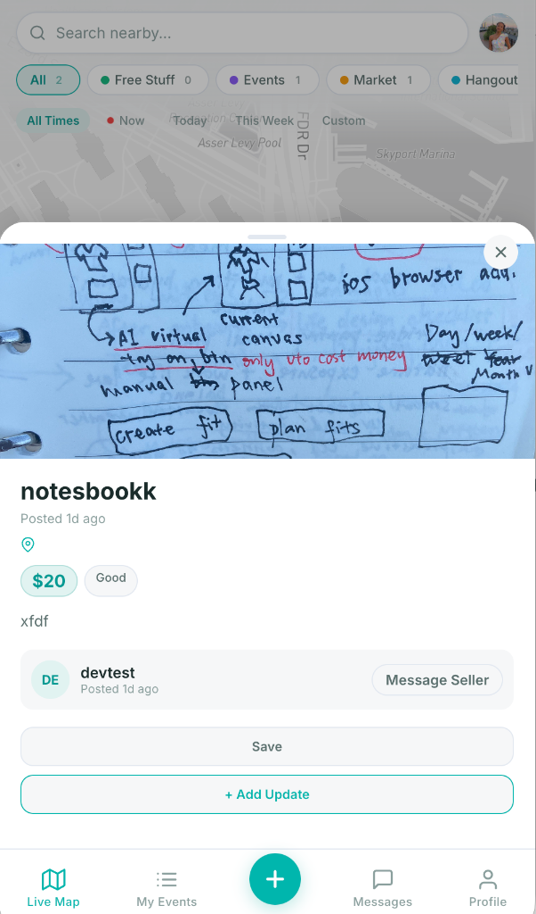
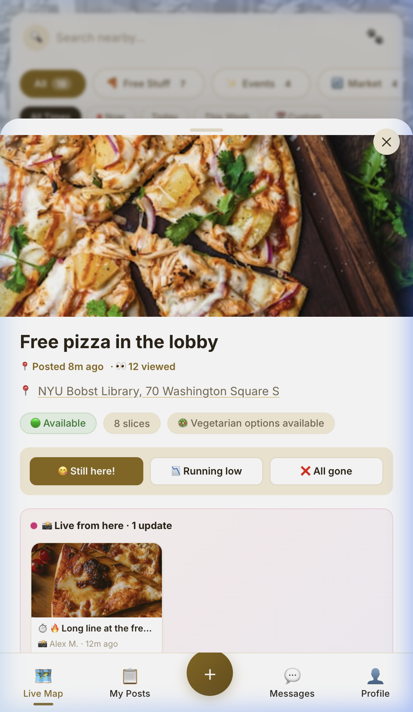
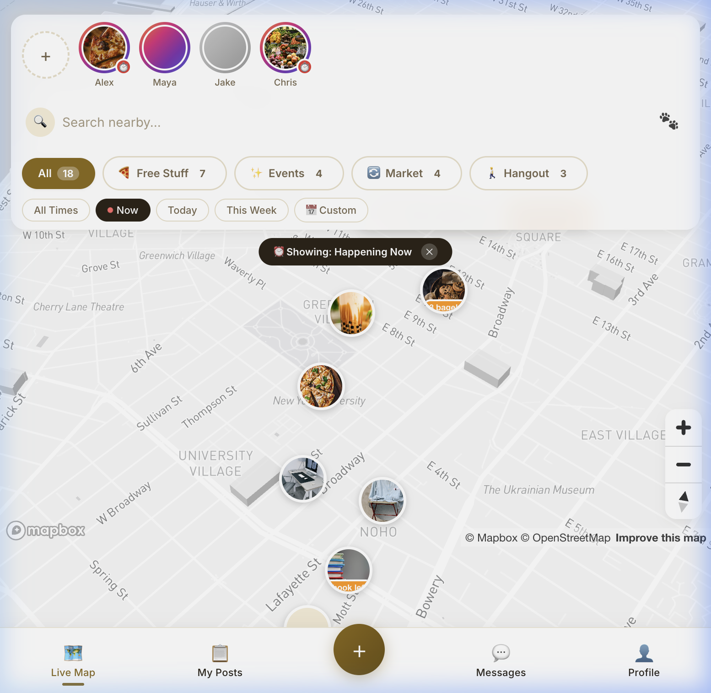
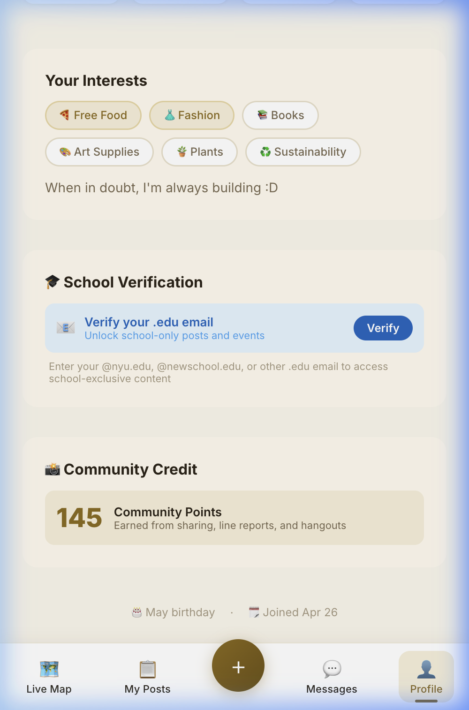

<p align="center">
 
 
 
</p>

# SUSU Map — Your Local Community Map

**Discover free food, live events, local trades, and spontaneous hangouts — all on one live map with real-time community stories.**

SUSU Map bridges food waste and food insecurity, connects community resources, and enables hyper-local coordination. Built for university communities starting with NYU and The New School.

---

## The Idea

Universities and local communities generate tons of underutilized resources every day — leftover food from events, art supplies after freshman year, furniture on the curb during move-out, vintage clothing nobody wears anymore. These resources get wasted while community members right next door could use them.

**SUSU Map puts everything on a live, layered map** so people can instantly see what's available near them — whether it's free pizza in the lobby, a sustainable fashion popup, or vintage Levi's for sale.

### One App, Five Layers

| Layer | What | Examples |
|-------|------|----------|
| **Free Stuff** | Free items available right now | Leftover food, curb stooping, dorm cleanout, art supplies |
| **Events** | Community happenings + auto-scraped NYC events | Fashion popups, swap meets, parks department events |
| **Market** | Buy, sell, rent, trade locally | Clothing, electronics, furniture — meet in person |
| **Hangout** | Spontaneous social plans | "Walking in Central Park, who'd join?", study groups, coffee |
| **Live Stories** | Real-time updates on map pins | Line reports, crowd shots, community moments |

All layers share the same map, the same community, and the same trust system. Toggle between them with a single tap.

---

## 📱 Screenshots

<p align="center">
 
 
 
</p>
<p align="center">
 <em>Map with story rings</em> · <em>Pin detail with live stories</em> · <em>Full-screen story viewer</em>
</p>

<p align="center">
 
 
 
</p>
<p align="center">
 <em>Time-based filtering</em> · <em>4 post types</em> · <em>Hangout + access scope</em>
</p>

<p align="center">
 
</p>
<p align="center">
 <em>Profile — .edu verification + community credit</em>
</p>

---

## Key Features

### Live Map Engine
- **Mapbox 3D Map** — Tilted, interactive map centered on your campus/neighborhood
- **Photo Pins** — Circular thumbnail pins with visual preview of each post
- **Layer Toggles** — Filter between All, Free Stuff, Events, Market, and Hangout
- **Color-Coded Status Rings** — Green (available), yellow (running low), red (happening now)
- **"Happening Now" Badge** — Floating count of active items at a glance

### Pin-Anchored Stories (Live Updates)
- **Gradient Story Ring** — Instagram-style rainbow ring on pins that have live stories
- **GPS-Verified Posting** — Users can only post stories when physically at the location
- **"Live from here" Section** — Tap a pin to see horizontally scrollable story thumbnails
- **Full-Screen Viewer** — Progress bars, reactions ( ), and community credit
- **Auto-Expiry** — Line reports expire in 2h, moments in 24h
- **Community Credit** — Earn +5 points for posting useful live updates

### Time-Based Filtering
- **Now** — Currently available free stuff + events happening now + open hangouts
- **Today** — Everything posted or starting today
- **This Week** — Last 7 days of activity
- **Custom** — Date/time range picker for specific windows

### Hangout Layer
- **Spontaneous Plans** — "Walking in Central Park — who'd like to join?"
- **Join Button** — Join with one tap, see joiner avatars and progress bar
- **Capacity Tracking** — `2/5 joined` badge on pins, auto-status when full
- **Activity Types** — Walking, studying, coffee, exploring, etc.

### Access Scope & School Verification
- **Per-Post Visibility** — Every post has a "Who can see this?" toggle:
 - Everyone (default)
 - My School Only (requires verified .edu email matching domain)
 - All College Students (any verified .edu email)
- **.edu Email Verification** — Verify in Profile to unlock school-only content
- **Progressive Unlock** — Unverified users see prompts to verify, not walls

### NYC Event Scraping
- **Automated Daily Import** — NYC Open Data API scraped at 6 AM for free public events
- **Source Attribution** — Scraped events show a badge on their pin
- **Deduplication** — Events matched by `sourceUrl` to avoid duplicates
- **Auto-Status** — Upcoming → Happening Now → Ended, based on time

### Free Stuff
- **Real-Time Status** — " Available" → " 3 bagels left" → " All gone"
- **Dietary Tags** — Vegetarian, vegan, gluten-free, etc.
- **Status Update Bar** — Crowdsourced status changes
- **Line Reports** — Stories posted by users physically at the location

### Events
- **RSVP System** — Track capacity and attendance
- **Calendar Integration** — Start/end times with smart formatting
- **Live Coverage** — Pin stories from attendees show crowd/line conditions

### Marketplace
- **Price Tags** — Inline price badge on pins
- **Condition Ratings** — New, Like New, Good, Fair
- **Trade Accepted** — Flag for barter-friendly sellers

### Profile & Trust
- **Community Credit** — Points earned from sharing, line reports, hangouts
- **School Verification** — .edu email verification with domain-specific gating
- **Interest Tags** — Free food, fashion, books, art supplies, etc.
- **Post History** — Organized by layer type

---

## Tech Stack

| Layer | Technology |
|-------|-----------|
| Framework | React 19 + TypeScript |
| Build | Vite 8 |
| Map | Mapbox GL JS |
| State | Redux Toolkit + RTK Query |
| Styling | Vanilla CSS with design tokens |
| Typography | Inter (Google Fonts) |
| Backend | Strapi v5 (Node 20+) |
| Database | SQLite (dev) / PostgreSQL (prod) |
| Scraping | NYC Open Data SODA API |
| Hosting | Railway / Hetzner + Coolify |

---

## Getting Started

### Prerequisites
- Node.js 20+
- npm 10+

### Installation
```bash
# Navigate to community-map in the monorepo
cd building-fashion-future/community-map

# Install dependencies
npm install

# Start dev server
npm run dev
```

The app will be available at **http://localhost:5173**

### Environment Variables
Create a `.env` file:
```env
VITE_MAPBOX_ACCESS_TOKEN=your_mapbox_token_here
VITE_STRAPI_URL=http://localhost:1337 # Optional, falls back to mock data
```

---

## Project Structure

```
community-map/
├── .env               # Mapbox access token
├── index.html            # Mobile-optimized HTML entry
├── package.json           # Dependencies
├── docs/               # App screenshots for README
├── src/
│  ├── main.tsx           # Entry point
│  ├── App.tsx            # Root component with tab routing
│  ├── index.css           # Design system (tokens, reset, animations)
│  ├── types.ts           # TypeScript types (layers, access scopes, stories)
│  ├── data/
│  │  └── mockData.ts       # 18 sample pins + 4 stories + layer config
│  ├── store/
│  │  ├── store.ts         # Redux store configuration
│  │  ├── authSlice.ts       # Auth + school verification state
│  │  └── communityApi.ts     # RTK Query endpoints (posts, stories, hangouts)
│  └── components/
│    ├── LiveMap.tsx / .css    # Mapbox map, story-ring pins, time filtering
│    ├── LayerToggle.tsx / .css  # 5-layer pill filter bar
│    ├── BottomSheet.tsx / .css  # Detail view (free/event/market/hangout + stories)
│    ├── StoriesBar.tsx / .css   # PinStories component + full-screen viewer
│    ├── TimeFilter.tsx / .css   # Now/Today/Week/Custom pill bar
│    ├── AccessScopeSelector.tsx / .css # Who-can-see-this toggle
│    ├── BottomNav.tsx / .css   # Tab bar with center FAB button
│    ├── QuickPostModal.tsx / .css # Post creation (4 types + access scope)
│    ├── MyPosts.tsx / .css    # User's post list
│    ├── MessagesPage.tsx / .css  # Conversations
│    └── ProfilePage.tsx / .css  # Profile, school verification, community credit
```

### Backend (Strapi v5 — in [building-fashion-future](https://github.com/SusannaShu/building-fashion-future) repo)
```
backend_strapi_v5/src/api/
├── community-post/
│  ├── content-types/community-post/schema.json # 30+ fields inc. hangout & access
│  ├── controllers/community-post.ts       # CRUD + status + RSVP + join/leave
│  ├── routes/custom-community-post.ts      # /status, /rsvp, /join, /leave
│  └── services/
│    ├── community-post.ts           # Core service + event status refresh
│    └── event-scraper.ts            # NYC Open Data scraper
├── community-story/
│  ├── content-types/community-story/schema.json # Ephemeral stories with auto-expiry
│  ├── controllers/community-story.ts       # CRUD + react
│  ├── routes/community-story.ts         # GET/POST + /react
│  └── services/community-story.ts        # Core service
```

---

## Roadmap

### Phase 1: Community Map MVP 
- [x] Live map with photo pins and 3D buildings
- [x] 4-layer toggle system (Free, Events, Market, Hangout)
- [x] Real-time status indicators with color-coded rings
- [x] Bottom sheet detail views for all post types
- [x] Quick post flow with type selector
- [x] Bottom navigation with all pages
- [x] Strapi v5 backend with Document Service API

### Phase 2: Live Stories & Social 
- [x] Pin-anchored stories (gradient ring + "Live from here" section)
- [x] Full-screen story viewer with reactions and community credit
- [x] GPS-verified story posting
- [x] Hangout layer with join/leave and capacity tracking
- [x] Time-based filtering (Now/Today/Week/Custom)
- [x] Access scope selector (Public/School Only/College Only)
- [x] .edu email verification flow in Profile
- [x] Community credit points system
- [x] NYC event scraper (daily cron from Open Data API)

### Phase 3: Production Ready
- [ ] Backend deployment (Railway or Coolify)
- [ ] Push notifications ("Free food near you!")
- [ ] Image upload for posts and stories (Cloudinary)
- [ ] Real-time WebSocket updates for status changes
- [ ] Access control middleware (filter by verified email domain)

### Phase 4: Expansion
- [ ] School event calendar integration (NYU, New School, etc.)
- [ ] Community groups (by school, org, interest)
- [ ] Virtual try-on / AR drops (from SUSU Map)
- [ ] Designer popup show features
- [ ] In-person transaction system for marketplace
- [ ] Rating and review system

---

## Why This Matters

- **40%** of food in the US goes to waste ([USDA](https://www.usda.gov/foodwaste/faqs))
- **1 in 3** college students experience food insecurity ([GAO](https://www.gao.gov/products/gao-19-95))
- **Tons** of perfectly good items get thrown away during college move-out every year
- Local communities have the resources — they just need better ways to connect

SUSU Map turns the existing flow of wasted resources into a **living, breathing community network** — one map pin at a time.

---

## Related Projects

SUSU Map grew out of the [Building Fashion Future](https://github.com/SusannaShu/building-fashion-future) ecosystem but is now a **standalone project** with its own repo. Sibling projects include:
- **SUSU Map** — Geo-based fashion treasure hunt with AR
- **Sheyou Fashion** — Buy, sell, rent, and loan fashion locally
- **SUSU Closet** — Digital wardrobe management

SUSU Map extends the map-first, community-driven philosophy to **all local resources** — not just fashion.

---

<p align="center">
 <strong> SUSU Map</strong> — Building local communities, one map pin at a time.
</p>
